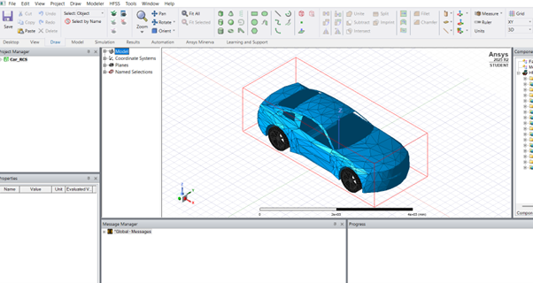
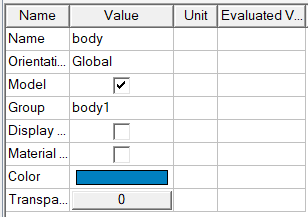
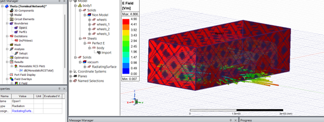
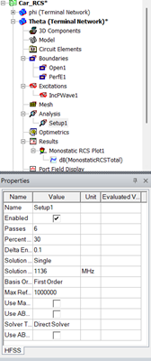
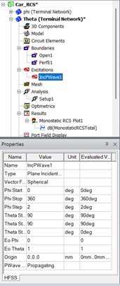
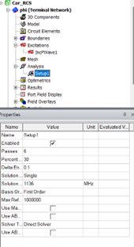
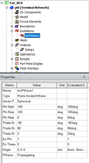
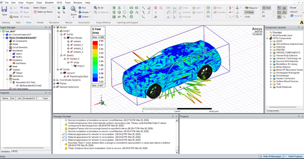
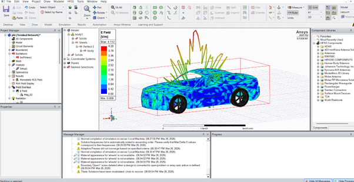

**Титульный лист**

Отчет по лекции 4: Создание электродинамических моделей | Ansys HFSS

ФИО: Поляков Никита Александрович

Группа: РИ-151121

Дата сдачи: 27.03.2026

Преподаватель: Денисов Д.В.

**Конспект лекции:**

Лекция будет посвящена различным методам расчета антенн в свободном пространстве с помощью программного обеспечения Ansys HFSS. Основное внимание будет уделено трем основным методам: методу конечных элементов (FEM), методу интегральных уравнений (IE), а также гибридным методам, объединяющим все лучшее от этих трех методов. Метод конечных элементов (FEM) используется для расчета электромагнитного поля в ограниченном объеме. В этом случае пространство ограничивается специальными граничными условиями: Radiation, FE-BI, PML. Метод интегральных уравнений - это совсем другая история. В этом случае расчет электромагнитного поля и тока происходит не в объеме, а на поверхности объекта с помощью 2D сетки. Распространение электромагнитного поля в пространстве рассчитывается на основе поверхностного анализа. В этом методе решателя отсутствует граница излучения, а это значит, что этот метод особенно удобен для расчета открытых проблем, таких как установка антенн на сложном объекте. Для расчета сложных проблем, в которых объекты находятся на большом расстоянии друг от друга, используют гибридные методы, которые позволяют не создавать объемную сетку в пространстве между объектами. Одним из гибридных методов является FE-BI. Этот метод позволяет передавать электромагнитное поле за пределы FEM области за счет граничных условий. С помощью этого метода можно возбудить отражатель, рассчитанный методом IE, с помощью рупора, находящегося в гибридной области FE-BI.

**Рефлексия по пройденному материалу:**

Данная лекция объяснила мне основы моделирования в HFSS. Отдельного внимания заслуживает упор на принципиальных разницах между объемным FEM и поверхностным IE, а также логическую необходимость гибридных методов при решении проблем с электрически большими расстояниями, на которых не целесообразно разбить сплошную сетку. Материал позволяет быстро осознать, какой солвер необходим при решении конкретной геометрии проблемы: FEM - для детального анализа компактных излучателей, IE - при работе с большими проводящими поверхностями, а гибридные регионы - для сложных систем типа зеркальных антенн.

**Постановка задачи:**

В программном пакете Ansys HFSS разработать модель для расчета диаграммы рассеяния (ЭПР) на автомобиле на частоте f = 1.136 ГГц при падении волны линейной поляризации из дальней зоны.

**Условия задачи:**

Номер варианта: 136

Частота: f = 1.136 ГГц

Падающая волна: Плоская волна, линейная поляризация

**Модель автомобиля с указанием материалов модели автомобиля:**

**Граничные условия:**

В данной задаче граничные условия задают внешнюю границу расчетной области, за пределами которой электромагнитное поле не вычисляется, а также определяют поведение поля на поверхности моделируемого объекта. В качестве внешней границы расчетной области используется прямоугольный параллелепипед внутри которого располагается модель автомобиля, и именно в этом прямоугольнике происходят все вычисления.

**Параметры задачи в горизонтальной плоскости:**

**В вертикальной плоскости:**

**Что такое ЭПР (RCS) объекта:**

Эффективная поверхность рассеяния (ЭПР) — это характеристика объекта, показывающая, какую мощность он переизлучает в направлении радиолокационной станции. ЭПР дает информацию о радиолокационной заметности объекта, позволяя определить его электрические размеры - чем выше значение ЭПР, тем крупнее объект относительно длины волны облучения. По угловой зависимости ЭПР можно судить о форме объекта: наличие узких лепестков указывает на плоские грани и угловые отражатели, а широкие плавные диаграммы характерны для закругленных поверхностей. Частотная характеристика ЭПР раскрывает информацию о материале объекта - резонансные пики свидетельствуют о диэлектрических свойствах, а равномерное возрастание с частотой характерно для идеальных проводников. Поляризационная зависимость показывает структурные особенности объекта: различие в рассеянии волн вертикальной и горизонтальной поляризации позволяет идентифицировать сложные объекты с анизотропными элементами.

**Диаграммы рассеяния ЭМ волны:** 

**Ссылка на репозиторий:**

https://github.com/NePolyak/-#
